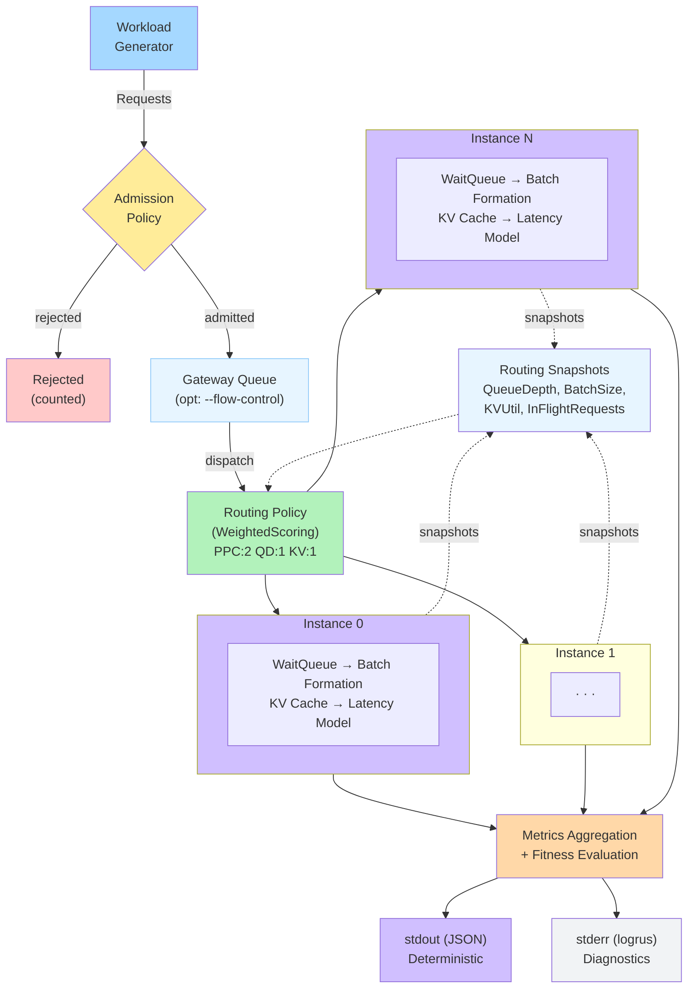
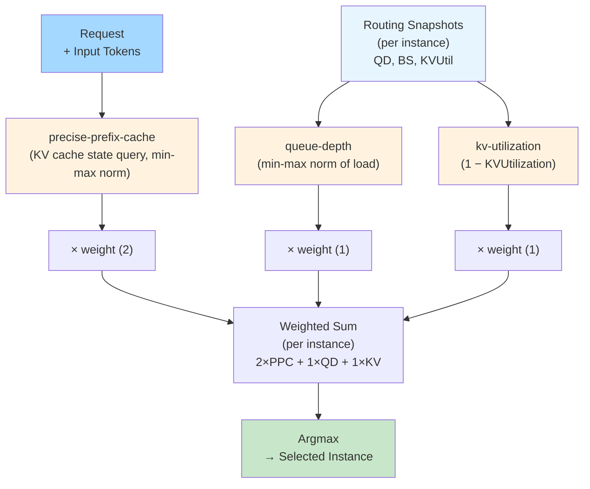
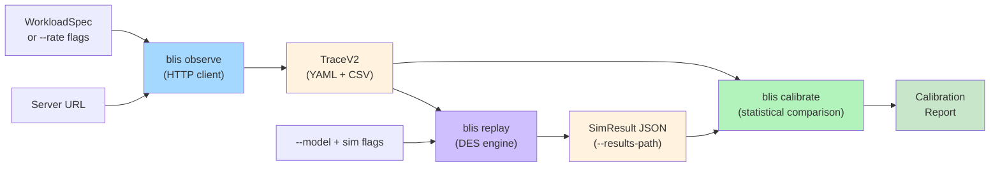

# Cluster Architecture

This page describes how BLIS simulates multi-instance inference serving clusters. For single-instance simulation internals, see [Core Engine](core-engine.md).

> **Canonical sources:** Signal freshness (INV-7) is defined in [`docs/contributing/standards/invariants.md`](../contributing/standards/invariants.md). If signal freshness descriptions here diverge, `invariants.md` is authoritative.

## Overview

A BLIS cluster consists of N independent inference instances orchestrated by a shared-clock event loop. Each incoming request passes through a three-stage pipeline — admission, routing, and per-instance processing — before metrics are aggregated across all instances.

## Shared-Clock Event Loop

The cluster simulator maintains a single global clock shared across all instances. At each iteration, it compares the earliest cluster-level event (request arrival, admission decision, routing decision) against the earliest per-instance event (step completion, queueing), and processes whichever is earlier.

**Ordering rules:**
- Cluster events at time T are processed before instance events at time T (cluster-first priority)
- When multiple instances have events at the same time, the instance with the lowest index goes first
- Within a single instance, events are ordered by `(timestamp, priority, seqID)` — the same three-key scheme used at the cluster level

The simulation terminates when the clock exceeds the configured horizon or no events remain.

## Admission Pipeline

Admission is the first gate in the online routing pipeline. Every incoming request is evaluated by the admission policy before being passed to routing.

### Built-in Admission Policies

| Policy | Behavior |
|--------|----------|
| `always-admit` | Accept all requests (default) |
| `token-bucket` | Rate-limiting via a token bucket with configurable capacity and refill rate |
| `tier-shed` | SLO-aware shedding: rejects low-priority tiers under overload (configurable threshold) |
| `gaie-legacy` | Production llm-d/GAIE parity: saturation-based shedding of sheddable requests (priority < 0) |
| `reject-all` | Reject all requests (for pathological testing) |

**Token bucket** rate-limits by consuming tokens proportional to input length: each request consumes tokens equal to its input token count, tokens refill at a constant rate, and requests are rejected when the bucket has insufficient tokens. Capacity and refill rate are configured via `--token-bucket-capacity` and `--token-bucket-refill-rate`.

**Tier-shed** rejects requests whose SLO tier priority falls below a configurable `tier_shed_min_priority` when any instance's effective load exceeds `tier_shed_threshold`. Non-sheddable tiers (critical, standard) are protected.

**GAIE-legacy** replicates the saturation-based admission from production llm-d's Gateway API Inference Extension. It computes pool-average saturation as `avg(max(qd/qdThreshold, kv/kvThreshold))` across instances. Non-sheddable requests (priority >= 0) always pass; sheddable requests are rejected when saturation >= 1.0. Defaults match GAIE production: `qdThreshold=5`, `kvThreshold=0.8`. See the [Admission Guide](../guide/admission.md#gaie-legacy-admission) for details.

Rejected requests are counted in the output metrics but do not enter the routing pipeline. To add a new admission policy, see [Extension Recipes](../contributing/extension-recipes.md). See [Configuration Reference](../reference/configuration.md#admission-policy) for flag details.

## Routing Pipeline

Routing selects which instance receives an admitted request. The routing policy sees a `RouterState` containing routing snapshots for all instances and the current simulation clock.

### Simple Routing Policies

| Policy | Selection Rule |
|--------|---------------|
| `round-robin` | Cyclic instance assignment |
| `least-loaded` | Instance with minimum effective load |
| `always-busiest` | Instance with maximum load (for pathological testing) |

**Effective load** is defined as `QueueDepth + BatchSize + InFlightRequests`, where `InFlightRequests` counts requests that have been dispatched to an instance but not yet completed. This tracks the full dispatch-to-response lifecycle, matching real HTTP router behavior (llm-d, Envoy).

### Weighted Scoring Policy

The `weighted` routing policy composes multiple scorers into a single routing decision. This is the recommended policy for production-like simulations and matches the architecture of real-world inference routers like llm-d's Endpoint Picker.

The routing decision follows this pipeline:

1. **Score:** Each scorer produces a per-instance score in [0, 1]
2. **Clamp:** Scores are clamped to [0, 1] (scorers should already produce values in this range)
3. **Weight:** Each score is multiplied by its configured weight
4. **Sum:** Weighted scores are summed across scorers for each instance
5. **Select:** The instance with the highest total score is chosen (argmax)

Default weights: `precise-prefix-cache:2, queue-depth:1, kv-utilization:1` (llm-d parity). Note: weights are normalized to sum to 1.0 before scoring, so only weight ratios matter — `precise-prefix-cache:2,queue-depth:1` is identical to `precise-prefix-cache:20,queue-depth:10`. To add a new scorer, see [Extension Recipes](../contributing/extension-recipes.md).

## Scorer Composition

Scorers are the building blocks of the weighted routing policy. Each scorer evaluates one signal dimension across all instances.

### Built-in Scorers

| Scorer | Signal | Score Computation | Notes |
|--------|--------|-------------------|-------|
| `prefix-affinity` | Prefix cache overlap | Proportion of request's block hashes found in instance's cache index | Stateful: updates cache index after routing via observer |
| `precise-prefix-cache` | Actual KV cache state | Min-max normalization of cached prefix block count per instance; all-equal (including all-zero) → 1.0 (llm-d parity) | Stateless: queries instance KV cache directly via `CacheQueryFn` |
| `no-hit-lru` | Routing history | Cold requests (zero cache hits): LRU positional scoring; warm requests: neutral 0.5 | Stateful: observer tracks LRU order on cold routing only |
| `queue-depth` | Queue depth | Min-max normalization of QueueDepth (lower depth = higher score) | Stateless |
| `kv-utilization` | Memory pressure | `1 - KVUtilization` (lower utilization = higher score) | Stateless |
| `load-balance` | Instance load | `1 / (1 + EffectiveLoad)` (decreasing function of load) | Stateless |
| `active-requests` | In-flight requests | `(maxCount - count) / maxCount` (zero in-flight = 1.0; all equal non-zero = 0.0) | Stateless |
| `running-requests` | Batch size | Min-max normalization of BatchSize (lower batch = higher score) | Stateless |
| `load-aware` | Queue depth | `0.5 * (1 - QueueDepth/128)` clamped at threshold; score range [0, 0.5] | Stateless |

### Stateful vs. Stateless Scorers

Most scorers are **stateless** — they compute scores purely from the current routing snapshot. Two scorers are **stateful**: `prefix-affinity` updates its router-side prefix cache index after each routing decision via an observer callback, and `no-hit-lru` tracks LRU ordering of cold request routing to distribute cache-miss traffic. The `precise-prefix-cache` scorer queries actual instance KV cache state directly (via `CacheQueryFn`) rather than maintaining a router-side approximation.

### Router-Side Prefix Cache Index

The prefix-affinity scorer maintains a lightweight approximate cache of per-instance block hash history. This is separate from the actual per-instance KV cache and serves as a routing-time estimate of cache hit probability.

Key properties:
- Per-instance LRU with bounded capacity (default: 10,000 blocks)
- Hierarchical block hashing: each block's hash chains with the prior block's hash for semantic prefix matching
- Updated synchronously after each routing decision (synchronous freshness)
- Score = proportion of request's block hashes found in the instance's cache index

## Signal Freshness

Routing decisions depend on instance state signals with different freshness guarantees. Understanding freshness tiers is important for interpreting simulation results under high load.

### Freshness Tiers

| Tier | Signals | Update Mechanism | Staleness |
|------|---------|------------------|-----------|
| **Synchronous** (router-local) | InFlightRequests, prefix cache index | Router increments InFlightRequests at dispatch, decrements at completion; prefix cache updated after each routing decision | None — router owns this state |
| **Immediate/Periodic** (instance-reported) | QueueDepth, BatchSize, KVUtilization, FreeKVBlocks, CacheHitRate, PreemptionCount | When `--snapshot-refresh-interval=0`: Immediate (read from instance at routing time). When `>0`: all instance-reported signals share the same Periodic refresh interval, matching real vLLM's single `/metrics` endpoint (#463). | Immediate: current within tick. Periodic: stale up to interval. |

The `--snapshot-refresh-interval` flag controls how frequently instance-reported signals (QueueDepth, BatchSize, KVUtilization, PreemptionCount, etc.) are re-read from instances. Setting it to 0 (default) makes all signals Immediate. Non-zero values introduce realistic staleness matching real vLLM Prometheus scrape intervals.

## Counterfactual Regret

When decision tracing is enabled (`--trace-level decisions`), BLIS computes counterfactual regret for each routing decision. This measures how much better an alternative routing choice could have been.

**Computation:**
1. Score all candidate instances using the routing policy's scoring function
2. Rank candidates by score (descending)
3. Compute `regret = best_score - chosen_score` (clamped to >= 0)
4. Record the top-k candidates with their scores and instance state

**Interpretation:**
- For the `weighted` policy, regret is typically zero because the chosen instance IS the highest-scored candidate
- For `round-robin`, regret is non-zero because the policy ignores load signals
- Higher regret does not necessarily imply worse performance — round-robin can achieve lower tail latency than least-loaded through perfect distribution uniformity

Configure counterfactual analysis via `--counterfactual-k` (number of candidates to record per decision).

## Metrics Aggregation

After simulation completes, per-instance metrics are aggregated into a unified cluster result:

| Metric Category | Aggregation |
|-----------------|-------------|
| TTFT, E2E | Combined across all instances. JSON output: mean, p90, p95, p99. Internal `Distribution`: also p50, min, max (used by fitness evaluation). ITL: mean, p90, p95, p99 in JSON output. |
| Throughput | Total output tokens / simulation time; total requests / simulation time |
| Request counts | Sum of completed, queued, running, preempted, dropped across instances |
| Per-SLO-class | Separate distributions per SLO class (for multi-tenant analysis) |
| Fairness | Jain Fairness Index across tenant throughputs |

### Fitness Evaluation

When `--fitness-weights` are configured, BLIS computes a single fitness score from the aggregated metrics. This enables automated policy comparison:

- Latency metrics (TTFT, E2E) are normalized via `1/(1 + value/1000)` where `value` is in ticks (microseconds) and 1000 ticks = 1ms is the reference point (lower latency = higher score). For example, TTFT of 50,000 ticks (50ms) maps to `1/(1+50) = 0.0196`.
- Throughput metrics are normalized via `value/(value + reference)` where `referenceRPS = 100.0` and `referenceTPS = 10000.0` (higher throughput = higher score)
- Normalized scores are multiplied by their configured weights and summed
- Higher fitness = better performance

Note: the normalization compresses raw metric differences significantly. A 38% TTFT improvement might map to only an 8% fitness score difference. Always examine raw metrics alongside fitness scores.

## Instance Isolation

Each instance in the cluster is a fully independent single-instance simulator with its own:
- Event queue and simulation state
- Wait queue and running batch
- KV cache (block allocation, prefix caching, LRU eviction)
- Latency model
- Scheduling and priority policies

Instances share the global clock but have no direct communication. All inter-instance coordination happens through the routing layer (via routing snapshots). This matches the architecture of real inference serving clusters where instances are independent processes.

## Online Routing Pipeline Walkthrough

A complete request lifecycle through the cluster pipeline:

1. **Generation:** The workload generator creates a request with arrival time, input tokens, and output tokens
2. **ClusterArrivalEvent:** Scheduled at the request's arrival time
3. **AdmissionDecisionEvent:** Admission policy evaluates the request
   - If rejected: request counted, pipeline ends
   - If admitted: proceed to routing (with optional `--admission-latency` delay)
4. **Gateway Queue (optional, `--flow-control`):** When flow control is enabled, admitted requests enter a priority-ordered gateway queue instead of routing immediately. A saturation detector evaluates cluster capacity on each completion; when saturation < 1.0, the highest-priority request is dequeued and routed with fresh `RouterState` (late binding). When disabled (default), this step is skipped.
5. **RoutingDecisionEvent:** Routing policy selects target instance
   - InFlightRequests for target instance incremented
   - Request injected into target instance's wait queue (with optional `--routing-latency` delay)
6. **QueuedEvent:** Fired by target instance when request enters its queue
   - If no StepEvent exists, one is scheduled (work-conserving)
7. **Per-instance processing:** Request follows the single-instance lifecycle (see [Core Engine](core-engine.md))
8. **Completion/Drop:** InFlightRequests decremented when request completes or is dropped as unservable
9. **Metrics:** Request metrics (TTFT, E2E, ITL) recorded at instance level, aggregated at cluster level

## Observe / Replay / Calibrate Pipeline

Alongside the DES simulation pipeline described above, BLIS provides an offline validation workflow for comparing simulator predictions against real server behavior. This pipeline has three stages, of which only **Replay** engages the DES event loop. **Observe** is an HTTP workload dispatcher that sends requests to a real inference server and records per-request timing. **Calibrate** is a statistical comparison tool that computes per-metric MAPE, Pearson R, and quality grades.

For the full pipeline guide with worked examples, see [Observe / Replay / Calibrate](../guide/observe-replay-calibrate.md). For flag details, see [Configuration Reference](../reference/configuration.md).
