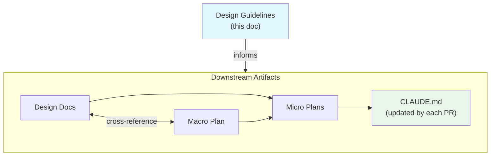
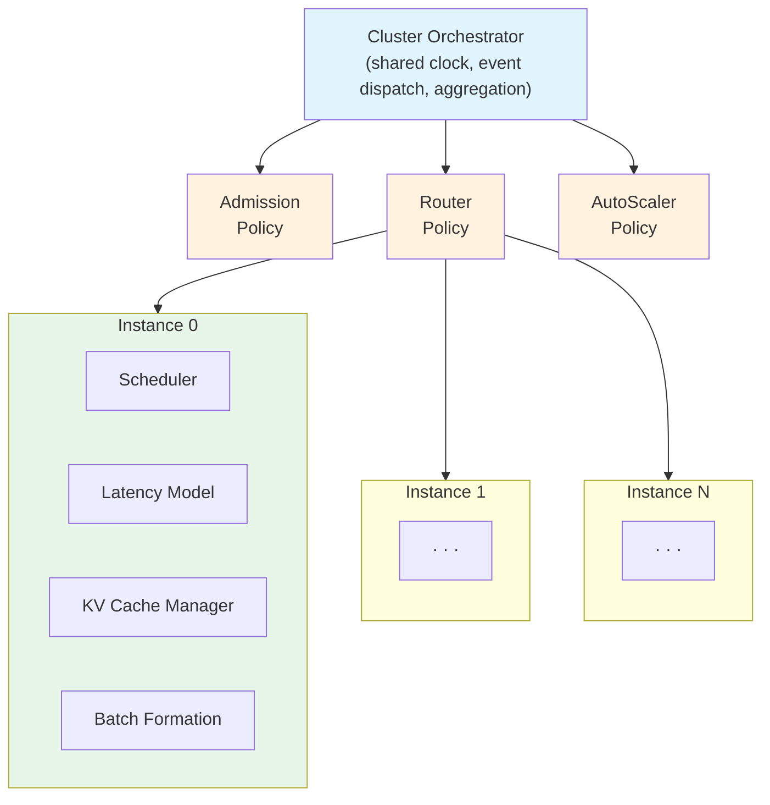

# BLIS Design Guidelines: Principles for Robust Simulation Design and Modular Extension

**Date:** 2026-02-18
**Status:** Draft (pending review)
**Species:** System Overview

## 1. Purpose & Scope

This document serves two audiences:
1. **Design doc authors** (human or Claude) — guidance on writing design docs that stay durable and useful across the project lifecycle
2. **Module developers** — guidance on extending BLIS with new modules that fit the architecture and enable parallel development

**What this document IS:**
- A target architecture specification that BLIS will be refactored toward
- A set of principles grounded in DES methodology and project experience (12 completed PRs, 20+ issues)
- A reference for evaluating whether a design doc or a new module meets BLIS's quality bar

**What this document is NOT:**
- Not an implementation plan (refactoring happens in separate PRs, each following `docs/contributing/pr-workflow.md`)
- Not a replacement for CLAUDE.md (which captures engineering rules and code-level patterns)
- Not a replacement for the micro-plan template (which captures PR-level planning structure)

### Relationship to Existing Docs

| Scenario | Path |
|---|---|
| Large multi-PR feature | Design doc → Macro plan → Micro plans per PR |
| Single-PR feature | Design doc → Micro plan directly |
| Refactoring / bug fix | Issue or design doc → Micro plan directly |
| Macro plan PR | Macro plan section → Micro plan |

**Key distinction:** This document describes the *target state* and *design principles*. CLAUDE.md describes the *current state* and *implementation rules*. Where they diverge, this document is aspirational and CLAUDE.md is authoritative for today's code.

---

## 2. DES Design Foundations

BLIS is a discrete-event simulator. Design docs for BLIS should be informed by established DES methodology (Banks et al., *Discrete-Event System Simulation*; Misra, *Distributed Discrete-Event Simulation*, 1986).

**Core Principle: Abstraction must be justified.** Every state variable, event type, and random input should be defensible in terms of the questions the simulator will answer — not fidelity for its own sake.

### 2.1 Model Scoping (Banks et al.)

Before including a component in BLIS, evaluate it against these six criteria:

1. Will including it significantly affect the accuracy of results for the target analysis questions?
2. What level of accuracy is actually required for the analysis to be useful?
3. Can the component's data requirements be satisfied (alpha/beta coefficients, hardware specs, workload traces)?
4. What is the cost of inclusion — code complexity, maintenance burden, configuration surface?
5. What breaks if we omit it? (Sensitivity analysis — if removing it changes results by <5%, defer it)
6. What is the simplest version that answers the same questions? (Start coarse, refine only with evidence)

These criteria operationalize "YAGNI" for simulation design. Example: the PR12 pre-design chose synchronous transfer latency over event-based transfers because it answered the same questions with ~100 fewer LOC.

### 2.2 Event Design

- Events must be **minimal and atomic** — each event corresponds to exactly one state change.
- Classify new events as **exogenous** (arrivals, environment changes — driven by workload input) or **endogenous** (completions, scheduling decisions, scaling actions — driven by internal state transitions). This classification must appear in design docs.
- New events must specify their **priority constant** for tie-breaking within BLIS's `(timestamp, priority, seqID)` ordering scheme.

### 2.3 State vs. Statistics Separation

- **State variables** evolve the system (queues, caches, clocks, request lifecycle) — they are inputs to event handlers.
- **Statistics** are derived from state trajectories (TTFT distributions, throughput, utilization) — they are outputs for analysis.
- These must be decoupled. A module that mixes state mutation and metric computation in the same method is violating this principle.

### 2.4 Verification and Validation

- **Verification**: the code correctly implements the conceptual model (behavioral tests, invariant tests, golden tests).
- **Validation**: the model accurately represents real-system behavior (calibration against real servers, sensitivity analysis, comparison with published benchmarks).
- A verified simulator can be an invalid model. (BLIS issue #183: golden tests verified the code did what it did, but an invariant test would have caught the dropped request.)
- Design docs must specify both: how will correctness be verified (which invariants?) AND how will fidelity be validated (against what real-system data?).

### 2.5 Randomness as First-Class Concern

- All randomness flows through `PartitionedRNG` with named subsystems.
- New modules that introduce randomness must declare their subsystem name and justify that their random draws don't interfere with existing streams.
- Design docs should consider whether the feature enables **common random numbers** experiments (paired comparison of two configurations using the same random stream).

### 2.6 DES Design Review Checklist

Every BLIS design doc must answer these questions:

| Question | Principle |
|---|---|
| What analysis questions does this design help answer? | Model scoping |
| What is modeled, simplified, and deliberately omitted? (Table format) | Model scoping |
| What events are introduced or modified? Exogenous or endogenous? | Event design |
| How do new events interact with existing tie-breaking rules? | Event design |
| What new state is introduced? Who owns it? | State/statistics separation |
| What new metrics are derived? Collected incrementally or on demand? | State/statistics separation |
| How will correctness be verified? (Which invariants?) | Verification |
| How will fidelity be validated? (Against what data?) | Validation |
| Does this introduce new randomness? Which PartitionedRNG subsystem? | Randomness |
| What is the simplest version that answers the same questions? | Model scoping |

---

## 3. Design Doc Guidelines

### 3.1 The Staleness Test

Before including any content in a design doc, apply this test:

> *"If the implementation changes this detail during micro-planning, will the design doc silently mislead future readers?"*

- **Durable content** (include): invariants, modeling decisions, fidelity trade-offs, extension points described behaviorally, decision rationale with alternatives considered.
- **Fragile content** (exclude): Go struct field lists, method implementations, file paths with line numbers, specific parameter names.

The dividing line: **describe what crosses a boundary and why, not how the boundary is implemented.**

### 3.2 Four Design Doc Species

Not all design docs serve the same purpose. Choose the right species based on scope:

| Species | When to Use | Structure | Example |
|---|---|---|---|
| **Decision Record** | Single-PR architectural choices that need trade-off analysis | Numbered decisions, each with Problem / Decision / Rationale / Alternatives | PR12 pre-design (9 decisions) |
| **Specification** | New subsystem with precise behavioral requirements | Behavioral contracts, math/formulas, input/output schemas, validation criteria | Workload generator design |
| **Problem Analysis** | Refactoring motivated by identified friction or bugs | Extension scenario analysis, antipattern catalog with evidence, phased fix plan | Hardening design |
| **System Overview** | Multi-PR feature spanning multiple modules | Concept model, module interactions, invariants, phased roadmap | Evolutionary policy optimization design |

A design doc should declare its species at the top so readers know what to expect.

### 3.3 Required Sections (All Species)

Every BLIS design doc, regardless of species, must include:

1. **Motivation** — What problem does this solve? What can't users do today? (2-5 sentences, no jargon)
2. **Scope** — What's in, what's explicitly out, what's deferred to later
3. **Modeling Decisions** — What is modeled, simplified, and omitted (table format per Section 2.1)
4. **Invariants** — What must always hold after this design is implemented? What must never happen? (Named: INV-1, INV-2, ...)
5. **Decisions with Trade-offs** — For each non-obvious choice: what alternatives were considered, why this one won, what breaks if it's wrong
6. **Extension Points** — Where do future extensions plug in? What is the default behavior? What would a non-default look like?
7. **Validation Strategy** — How will correctness be verified (invariants) and fidelity be validated (calibration, comparison)?
8. **DES Checklist** — Completed checklist from Section 2.6

### 3.4 Prohibited Content

Do NOT include in design docs (with rationale from project experience):

| Content | Why Not | What to Write Instead |
|---|---|---|
| Go struct definitions with field lists | Diverged within 2 PRs in the original design doc — "aspirational signatures" | Describe what data crosses the boundary and its semantics |
| Method implementations | Changed during micro-planning in every PR | Describe the behavioral contract (GIVEN/WHEN/THEN) |
| File paths with line numbers | Stale after any refactoring | Name the module and its responsibility |
| Specific parameter/field names | Renamed during implementation | Describe the concept ("load metric combining queue depth and batch size") |
| Interface signatures in Go syntax | Froze prematurely in original design doc; actual interfaces were simpler | Describe the interface's contract: single method? what it observes? what it returns? |

**Exception:** Decision Records (species 1) may include brief code snippets when the decision IS about a specific implementation choice (e.g., "use `math.Ceil` not integer division"). Keep these minimal.

### 3.5 Abstraction Levels Across Document Tiers

| Content Type | Design Doc | Macro Plan | Micro Plan |
|---|---|---|---|
| System invariants | Define (named: INV-1, ...) | Reference | Refine to GIVEN/WHEN/THEN |
| Modeling decisions (modeled/simplified/omitted) | Define with justification | Summarize | N/A |
| Module boundaries (behavioral) | Define contract | Reference + annotate per-PR | Implement |
| Interface signatures (Go code) | No | Frozen post-freeze PR | Full code |
| File paths | No | Inventory + per-PR | Exact `file:line` |
| Fidelity trade-offs | Define with alternatives | Reference | Deviation log if changed |

---

## 4. Module Architecture Principles

### 4.1 Two-Layer Architecture

BLIS is organized as two layers:

**Layer 1: Simulation Kernel** — domain-agnostic DES infrastructure
- Event queue (min-heap with deterministic tie-breaking)
- Clock management (next-event time advance)
- Randomness (PartitionedRNG with named subsystems)
- Statistics collection (accumulators decoupled from state)
- Experiment control (seed, horizon, configuration)

**Layer 2: Domain Modules** — inference-platform-specific model logic, each behind an interface

The kernel provides the execution substrate. Domain modules define *what* is being simulated. The kernel never contains inference-specific logic; domain modules never manage the event queue or clock directly.

### 4.2 Domain Module Map

BLIS models an extensible distributed inference platform — not any single system. llm-d, vLLM, SGLang, Mooncake, and LMCache are all target systems whose behaviors should be expressible through BLIS's module composition.

| Module | Responsibility | Interface Today | Status |
|---|---|---|---|
| **Admission** | Accept/reject requests at cluster entry | `AdmissionPolicy` (single method) | Implemented, frozen |
| **Router** | Select target instance for admitted requests | `RoutingPolicy` (single method) | Implemented, frozen |
| **Scheduler** | Order queued requests within an instance | `InstanceScheduler` (single method) | Implemented, frozen |
| **Priority** | Compute request priority for scheduler | `PriorityPolicy` (single method) | Implemented, frozen |
| **KV Cache Manager** | Allocate/release/cache KV blocks | `KVStore` (11 methods) | Implemented |
| **AutoScaler** | Add/remove instances based on load signals | `AutoScalePolicy` (planned) | Target — PR11 |
| **Latency Model** | Estimate step execution time | `LatencyModel` (3 methods) | Implemented — `NewLatencyModel` factory |
| **Batch Formation** | Select requests from queue for next step | `BatchFormation` (1 method: `FormBatch`) | Implemented — `NewBatchFormation` factory |
| **Workload Generator** | Produce request streams from specs/traces | `GenerateRequests()` function | Implemented |
| **Trace Recorder** | Record decisions for analysis | `SimulationTrace` | Implemented |
| **Metrics Collector** | Aggregate per-request and system-level metrics | `CollectRawMetrics()` function | Implemented |

**"Target" means:** the module exists as embedded logic today but lacks an interface boundary. Refactoring PRs will extract the interface. The guidelines define what that interface contract should look like.

### 4.3 Module Contract Template

Every module (current or target) is defined by this contract:

1. **Observes** — what state does this module read? (Its inputs)
2. **Controls** — what decisions does this module make? (Its outputs)
3. **Owns** — what mutable state does this module exclusively manage?
4. **Invariants** — what must always hold for this module?
5. **Events** — what events does this module produce or consume? (Exogenous/endogenous classification)
6. **Extension friction** — how many files must change to add one more variant of this module?

Example — Router module contract:

| Aspect | Contract |
|---|---|
| **Observes** | Request metadata (tokens, prefix, SLO class, tenant), per-instance snapshots (queue depth, batch size, KV utilization, cache hit rate, pending requests), cluster clock |
| **Controls** | Target instance selection, priority hint for downstream scheduler |
| **Owns** | No mutable state (stateless policy; any affinity tracking is internal to the policy instance) |
| **Invariants** | Must select from non-empty snapshot list. Must return a valid instance ID. Selection must be deterministic given same inputs and RNG state. |
| **Events** | Consumes: `AdmissionDecisionEvent` (admitted=true). Produces: `RoutingDecisionEvent`. |
| **Extension friction** | 3 files to add a new routing algorithm (policy file, bundle.go registration, cmd/root.go validation message) |

### 4.4 Real-System Correspondence

BLIS modules map to real inference system components, but the mapping is many-to-many — BLIS must be able to express behaviors from multiple real systems:

| BLIS Module | llm-d | vLLM | SGLang | Mooncake |
|---|---|---|---|---|
| Router | Endpoint Picker | N/A (single-instance) | N/A (single-instance) | Global scheduler |
| Scheduler | N/A (engine-internal) | `Scheduler` class | `Scheduler` class | Prefill/decode scheduler |
| KV Cache Manager | N/A (engine-internal) | `BlockManager` | `RadixCache` | Distributed KV pool |
| Latency Model | N/A (real latency) | N/A (real latency) | N/A (real latency) | N/A (real latency) |
| AutoScaler | HPA / custom | N/A | N/A | N/A |
| Batch Formation | N/A (engine-internal) | Continuous batching | Chunked prefill | Disaggregated batching |

The design implication: module interfaces must be **abstract enough** to express all these variants, but **concrete enough** to capture the behavioral differences that matter for analysis. The modeling decisions table (Section 2.1) determines where on this spectrum each module sits.

### 4.5 The Touch-Point Rule

When a design doc introduces a new module boundary, it must specify the expected touch-point count for adding one more variant. The following are **reference targets** based on what works well in the current codebase:

| Extension Type | Reference Target | Current Reality |
|---|---|---|
| New policy template | ~3 files | 3 files (meets target) |
| New KV cache tier | ~4 files | 4-5 files (acceptable) |
| New config parameter | ~2 files | 2 files (meets target — post-#381) |
| New observable metric | ~3 files | 6 files (exceeds — known friction) |
| New latency model backend | ~2 files | 2 files (meets target) |
| New batch formation strategy | ~2 files | 2 files (meets target) |

If a design exceeds the reference target, the design doc must acknowledge the friction and explain whether it's acceptable (justified complexity) or whether structural improvement should happen first or concurrently. The goal is **awareness, not rigidity** — some modules genuinely require more touch points, but that should be a conscious choice, not an accident.

### 4.6 Parallel Development Enablement

Module boundaries enable parallel development when:

1. **Interfaces are stable** — frozen after a designated PR (as done with policy interfaces after PR8)
2. **Contracts are testable independently** — each module can be tested with mock implementations of adjacent modules
3. **No shared mutable state** — modules communicate through defined inputs/outputs, not through shared globals or reaching through struct fields
4. **Bridge types at boundaries** — when two modules in different packages need shared types, bridge types live in the lower-level package (e.g., `RouterState` in `sim/` not `sim/cluster/`)

A design doc for a new module must demonstrate that two developers could work on different implementations of that module's interface simultaneously, with only behavioral contract tests to keep them aligned.

---

## 5. Extension Framework

### 5.1 Extension Taxonomy

There are four fundamentally different ways to extend BLIS:

| Type | What It Is | Example | Scope |
|---|---|---|---|
| **Policy Template** | New algorithm behind an existing interface | New routing algorithm (e.g., power-of-two-choices) | Single file + registration |
| **Subsystem Module** | New module with its own interface, events, and state | AutoScaler, P/D disaggregation | New interface + integration |
| **Backend Swap** | Alternative implementation of an internal module | SGLang latency model alongside vLLM, RadixCache alongside block-based KV | New implementation behind existing interface |
| **Tier Composition** | Layering an existing module with additional behavior | NVMe KV tier wrapping GPU+CPU tiers, network latency wrapping base latency | Decorator/delegation over existing module |

Understanding which type an extension is determines which recipe to follow.

### 5.2 Recipe: Policy Template

*Adding a new algorithm behind a frozen interface.*

This is the lightest extension type. The interface already exists, the factory already exists, the CLI integration pattern is established.

**Prerequisites:** The target policy interface must exist and be stable.

**Contract the new template must satisfy:**
- Implements the interface (single method)
- Deterministic given same inputs and RNG state
- No side effects beyond its owned state (if stateful)
- Handles edge cases defined by the interface (e.g., empty snapshot list for routing policies)

**Steps:** Documented in CLAUDE.md "Adding New Policy Templates" — these guidelines don't duplicate, they reference.

**Parallel development:** Multiple policy templates for the same interface can be developed simultaneously by different contributors with zero coordination, since they share only the interface contract.

### 5.3 Recipe: Subsystem Module

*Adding an entirely new module with its own behavioral contract.*

This is the most architecturally significant extension type. Examples: AutoScaler (PR11), framework adapters (PR15).

**Design doc must define:**

1. **Module contract** (per Section 4.3 template — observes, controls, owns, invariants, events, extension friction)
2. **Interface design** — prefer single-method interfaces where possible. If multiple methods are needed, justify each one. The interface must be testable with a mock.
3. **Event integration** — what new event types are added to the cluster event queue? What are their priority constants? How do they interact with existing events?
4. **State ownership** — what new mutable state does this module introduce? Who creates it, who reads it, who mutates it? No shared mutable state across module boundaries.
5. **Failure modes** — what happens when the module fails? (Error return? Panic? Graceful degradation?) Which error handling boundary applies? (See CLAUDE.md Engineering Principles)
6. **Default behavior** — what does BLIS do when this module is not configured? (A no-op default must exist so existing workflows are unaffected)
7. **Configuration surface** — what CLI flags / YAML config does this add? Validated how?

**Design doc must demonstrate:**
- The module can be tested in isolation with mocked dependencies
- Adding the module doesn't change behavior of existing tests (no-op default)
- The extension friction for adding a second implementation is within reference targets from Section 4.5

**Parallel development:** Once the interface is agreed and frozen, the module implementation and its integration into the cluster orchestrator can proceed independently.

### 5.4 Recipe: Backend Swap

*Alternative implementation of an internal module that currently has no interface.*

This is the extension type that requires refactoring first. Examples: SGLang latency model, continuous-vs-chunked batching.

**Two-phase approach:**

**Phase A — Extract interface (refactoring PR):**
- Identify the hardcoded logic (e.g., `Step()` calling a specific latency estimator directly)
- Define an interface that captures the behavioral contract of the existing implementation
- Extract the existing implementation behind the new interface
- Verify: all existing tests pass, no behavior change, the factory returns the existing implementation by default

**Phase B — Add alternative (extension PR):**
- Implement the new backend behind the extracted interface
- Add configuration to select between backends (CLI flag or YAML)
- Add behavioral tests for the new backend
- Verify: existing tests still pass when default backend is selected

**Design doc must cover both phases.** Phase A is often the harder design challenge — getting the interface abstraction right so that it accommodates both the existing and new backends without over-generalizing.

**Key principle:** The interface should capture **what** the module does (behavioral contract), not **how** one particular backend does it. If the interface has methods that only make sense for one backend, it's too specific.

**Parallel development:** After Phase A merges, multiple backends can be developed simultaneously.

### 5.5 Recipe: Tier Composition

*Layering additional behavior onto an existing module via delegation.*

This is the pattern used by `TieredKVCache` (wraps `KVCacheState`) and could be used for network latency (wraps base latency model), caching layers, or monitoring wrappers.

**Design doc must define:**
- Which existing interface is being composed
- What new behavior the wrapper adds (offloading, caching, monitoring, latency injection)
- How metrics aggregate across tiers (the wrapper must expose the same metrics interface as the inner module, combining results appropriately)
- How configuration selects the composition (e.g., `--kv-cpu-blocks > 0` triggers tiered wrapping)

**Key principle:** The wrapper must satisfy the same interface contract as the inner module. Any caller that works with the inner module must work identically with the wrapper (Liskov substitution).

**Parallel development:** Wrappers are naturally parallelizable — different tiers or decorators can be developed independently as long as they compose through the same interface.

### 5.6 Extension Checklist

Before submitting a design doc for any extension, verify:

- [ ] Extension type identified (policy template / subsystem module / backend swap / tier composition)
- [ ] Correct recipe followed
- [ ] Module contract defined (observes / controls / owns / invariants / events / friction)
- [ ] No-op default exists (existing behavior unchanged when extension not configured)
- [ ] Interface testable with mocks (no concrete dependencies leaked through interface)
- [ ] Parallel development path described (what can proceed independently after interface freeze?)
- [ ] Touch-point count specified for adding one more variant
- [ ] DES checklist from Section 2.6 completed
- [ ] New randomness declared (PartitionedRNG subsystem name)
- [ ] Event priority constants assigned (if new events introduced)

---

## 6. Anti-Patterns with Evidence

Every anti-pattern in this section traces to a real bug, a real friction point, or a real design doc failure from BLIS's development history.

### 6.1 Design Doc Anti-Patterns

| Anti-Pattern | What Happened | Lesson |
|---|---|---|
| **The Type Catalog** | The original design doc contained ~600 lines of Go struct definitions. Within 2 PRs, `RouterState` went from a 5-section struct to `Snapshots + Clock`. `InstanceScheduler` went from 3 methods to 1. The macro plan called these "aspirational signatures that diverged during implementation." | Describe module boundaries behaviorally, not as Go types. Types change; contracts persist. |
| **Fidelity for Its Own Sake** | The original design doc specified `ShadowKVModel` with `PrefixHashes`, `EstimatedUtilization`, `EvictionQueue` — none of which were needed for the analysis questions BLIS answers today. | Apply Banks et al.'s six model scoping criteria. If you can't name the analysis question a component answers, defer it. |
| **Silent Staleness** | The design doc's `RoutingDecision` struct had 8 fields. The implemented version has 4. No mechanism flagged the divergence. Meanwhile, micro-plan deviation logs caught discrepancies with the macro plan because there was an explicit comparison step. | Higher-level docs need an explicit freshness mechanism. Design docs should version their decisions and mark which are implemented (e.g., a Decision Status column: Proposed / Implemented / Superseded). |
| **Missing Trade-off Rationale** | Several design doc decisions had no alternatives listed. When implementation revealed a better approach, there was no record of why the original choice was made. | Every non-obvious decision must list alternatives considered and why they were rejected. This is what makes the PR12 pre-design valuable — each of its 9 decisions has explicit rationale. |

### 6.2 Module Architecture Anti-Patterns

| Anti-Pattern | What Happened | Lesson |
|---|---|---|
| **Shotgun Surgery** | Adding `InstanceID` to per-request metrics (#181) required changes in 4 files. Three construction sites for `RequestMetrics` existed, and one was missed initially. | Use canonical constructors. Design docs for new types must specify whether a canonical constructor is needed. |
| **Destructive Read** | `KVStore.PendingTransferLatency()` both queried and cleared the accumulated latency. Callers couldn't distinguish "no latency" from "already consumed." Identified as blocking LMCache integration. | Query methods must be pure. If a method needs to both query and clear state, provide separate `Get()` and `Consume()` methods. |
| **Interface Leaking Implementation** | `KVStore` interface has 11 methods, several exposing block-level semantics. A distributed KV cache like LMCache doesn't think in blocks — it thinks in tokens and layers. The interface encodes vLLM's implementation model, not the abstract behavioral contract. (#246) | Design interfaces around the behavioral contract (allocate space, check cache, release space), not around one implementation's data model. |
| **Monolith Method** | `Simulator.Step()` was 152 lines mixing 4 concerns. Decomposed into named phase methods (`scheduleBatch`, `executeBatchStep`, `processCompletions`, `scheduleNextStep`). | Each module's logic should be callable through its interface. When a method contains logic for multiple modules, extract each into its module's interface method. |
| **Config Mixing Concerns** | `SimConfig` combined 23 fields from 8 concerns. Decomposed into 6 embedded sub-configs with canonical constructors (`NewKVCacheConfig`, etc.). Adding a field now touches 2 files; the compiler catches all call sites. | Group configuration by module. Each module's config should be independently specifiable and validatable. |

### 6.3 DES-Specific Anti-Patterns

| Anti-Pattern | What Happened | Lesson |
|---|---|---|
| **Golden Tests Without Invariant Tests** | The golden dataset test for codellama expected 499 completions. The code silently dropped one request on KV allocation failure (#183). The golden test encoded the bug as the expected value for months. | Golden tests answer "did the output change?" Invariant tests answer "is the output correct?" Both are needed (Banks et al.: verification ≠ validation). |
| **Non-Deterministic Map Iteration** | Five sites iterated Go maps to accumulate floats or determine output ordering. Go map iteration is randomized, violating the determinism invariant. | All randomness must flow through PartitionedRNG. Map iteration is a hidden source of non-determinism. Sort keys before any iteration that affects output. |
| **Mixing Exogenous and Endogenous** | The cluster workload generator (exogenous) was tightly coupled to the cluster simulator (endogenous). Impossible to replay the same workload through different configurations without re-generating. PR10 decoupled them. | Exogenous inputs must be separable from endogenous logic. This enables the fundamental simulation experiment: same input, different configuration, compare results. |

### 6.4 The Meta-Lesson

All these anti-patterns share one root cause: **the design was expressed in terms of implementation rather than behavior.** When a design doc specifies Go structs instead of behavioral contracts, the implementation becomes the specification. When a module boundary is defined by its internal data model instead of its observable behavior, the boundary can't accommodate a second implementation.

> **Describe what a module does and what it guarantees, not how it's built.**

If a design doc follows this principle, its content stays durable, its modules stay extensible, its interfaces accommodate multiple backends, and parallel development is naturally enabled — because contributors agree on behavior, not on implementation.

---

## References

1. Banks, J., Carson, J. S., Nelson, B. L., & Nicol, D. M. *Discrete-Event System Simulation* (5th ed.). Pearson. — Foundational text on DES methodology, model scoping, input modeling, output analysis, V&V.
2. Misra, J. "Distributed Discrete-Event Simulation." *Computing Surveys*, Vol. 18, No. 1, March 1986. — Formal correctness proofs for DES, causal ordering, simulation as formal property.
3. BLIS Issue #183 — Golden dataset encoded a silently-dropped request. Conservation invariant test would have caught it on day one.
4. BLIS PR12 Pre-Design (`docs/plans/archive/pr12-architectural-predesign.md`) — Gold standard for decision records: 9 decisions, each with trade-off analysis.
5. BLIS Hardening Design (`docs/plans/archive/2026-02-18-hardening-antipattern-refactoring-design.md`) — Extension scenario analysis identifying friction points for autoscaling, LMCache, heterogeneous HW, new engines.
